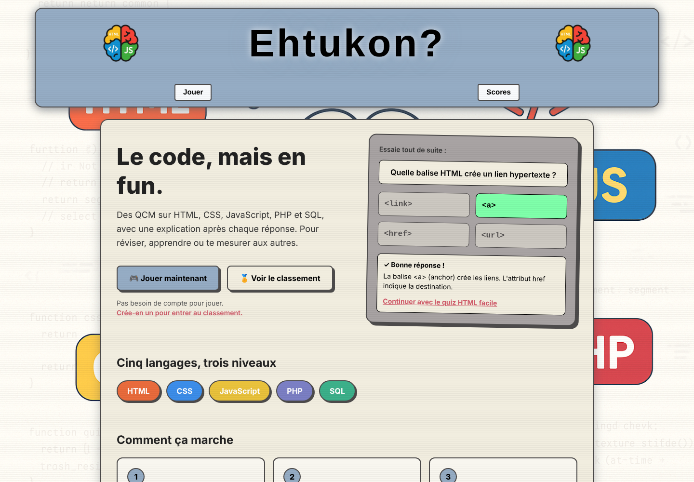

# Ehtukon? — Le code, mais en fun

Quiz de programmation en ligne : des QCM sur **HTML, CSS, JavaScript, PHP et SQL**, sur trois niveaux, avec une explication après chaque réponse et un classement des joueurs.

**🔗 Jouer en ligne : [projet-ehtukon.loic-lepreux.com](https://projet-ehtukon.loic-lepreux.com)**



## Fonctionnalités

- **5 langages × 3 niveaux** (facile, moyen, difficile), questions mélangées à chaque partie
- **Une explication après chaque réponse**, pour apprendre en jouant
- **Mode invité** : on joue sans compte ; on se connecte pour enregistrer son score
- **Classement** par langage et par niveau
- **Comptes utilisateurs** avec session persistante (on reste connecté après un rechargement)
- **Question de démonstration** jouable directement depuis l'accueil
- **Responsive**, du téléphone à l'écran large
- **Application mobile** Expo (React Native) qui partage la même API

## Stack technique

| Partie | Technologies |
|---|---|
| **Monorepo** | Turborepo, pnpm workspaces, types partagés (`packages/shared`) |
| **API** | NestJS 11, Prisma, MySQL, Passport JWT, class-validator, Swagger |
| **Web** | React 19, TypeScript, Vite, Tailwind CSS 4, TanStack Query, Zustand, React Router |
| **Mobile** | Expo, React Native, Expo Router |

## Sécurité

- **Mots de passe** hachés avec bcrypt
- **Authentification JWT** : access token (15 min) et refresh token (7 jours) dans des **cookies httpOnly**, avec rotation du refresh token à chaque renouvellement et renouvellement automatique côté client
- **Correction côté serveur** : les bonnes réponses ne sont jamais envoyées au navigateur avant que le joueur ait répondu, et le score est calculé par l'API à partir des réponses — le classement ne peut pas être falsifié
- **Validation** de toutes les entrées avec des DTO (`class-validator`, `whitelist` + `forbidNonWhitelisted`)

## Architecture

```
apps/
├── api/      API NestJS (auth, questions, scores) + Prisma
├── web/      Site React (Vite)
└── mobile/   Application Expo
packages/
└── shared/   Types TypeScript partagés entre l'API, le web et le mobile
```

### Routes de l'API

| Méthode | Route | Rôle |
|---|---|---|
| `POST` | `/auth/register` · `/auth/login` | Inscription, connexion |
| `POST` | `/auth/refresh` · `/auth/logout` | Renouveler la session, se déconnecter |
| `GET` | `/auth/me` | Utilisateur connecté |
| `GET` | `/questions?theme=&niveau=` | Questions d'un quiz (sans les réponses) |
| `POST` | `/questions/:id/check` | Vérifier une réponse |
| `POST` | `/scores` | Enregistrer une partie (score calculé par l'API) |
| `GET` | `/scores/leaderboard` · `/scores/me` | Classement, historique personnel |

Documentation interactive (Swagger) : `http://localhost:3001/api/docs`

## Lancer le projet en local

Prérequis : **Node.js 20+**, **pnpm** et **Docker**.

```bash
# 1. Installer les dépendances
pnpm install

# 2. Démarrer la base MySQL
docker compose up -d

# 3. Configurer l'API
cp .env.example apps/api/.env

# 4. Créer les tables et ajouter les questions
pnpm --filter @ehtukon/api exec prisma migrate deploy
pnpm --filter @ehtukon/api seed

# 5. Lancer l'API et le site
pnpm dev
```

- Site : http://localhost:5173
- API : http://localhost:3001

## Auteur

**Loïc Lepreux** — [Portfolio](https://loic-lepreux.com) · [GitHub](https://github.com/loiclepreux)
